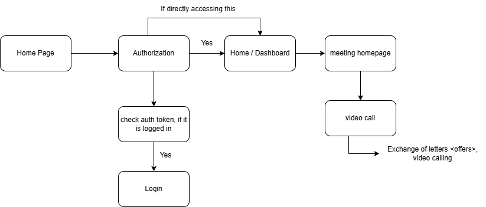

# Project - Video Conferencing App

## Fundamentals

Socket
    - A Socket is one end of connection
    - Socket is made up of ip and port

Protocols
    - Communication rules
    
    1. TCP (Transmission Control Protocol)
        - browser, google drive uses this protocol
        - reliable
        - slow as compare to UDP
        - connection based protocol

    2. UDP (User Datagram Protocol)
        - faster but less reliable
        - eg. video call
        - connectionless protocol

### WebRTC for Vidio communication
    - Web Real Time Communication
    - Build primirily on UDP
    - Open source protocol (Bi-direction)

    Stages:
        1. Signalling
            - Signalling server
            - SDP (Session Description protocol)
        2. Connecting
            - ICE (Interactive Connectivity protocol)
        3. Securing
            - DLTS & SRTP
        4. Communicating
            - RTP & SCTP

    API's:
        1. MediaStream
        2. RTCPeerConnection
        3. RTCDataChannel

    Architectures:
        1. P2P (peer to peer)
            - we are using this.
            - client to client transaction there is no sever in between them.
            - load on client
            - not suited for more number of machines

        2. SFU (selective forwarding unit)
            - server is there so client will send data to server and server will send data to clients.
            - efficient for more number of nodes.
            - load on server
            - server recevies one stream from client and send them multiple streams.

        3. MCU (Multi point control unit) 
            - most load on server
            - server receives one stream from client and send them one combined stream.

## Requirement Gathering

Our Architecure for app will be:

Database: 
    1. user database
    2. meeting 
    
## Technologies 

Database: MongoDB

Backend :
    1. Bcrypt (for passwords)
    2. Crypto
    3. Socket
        Long pollin is a technique where the client makes a request to the server, and the server holds the response until new data is available, effectively keeping the connection open longer to reduce latency for real-time updates.
    4. Express.js

Frontend:
    1. Materual UI
    2. WebRTC
    3. React.js
    4. Axios
    5. CSS

packages installed:
express, mongoose, bcrypt, http-status, cors